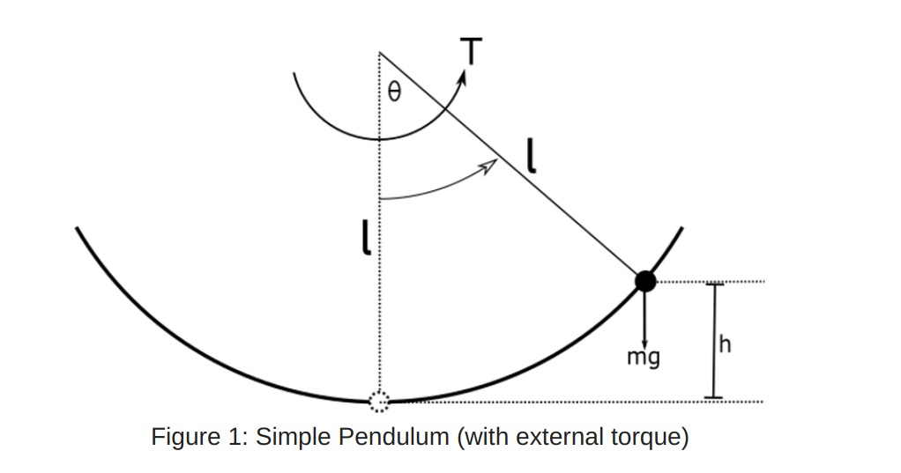
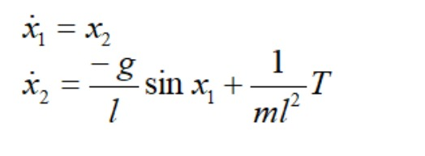
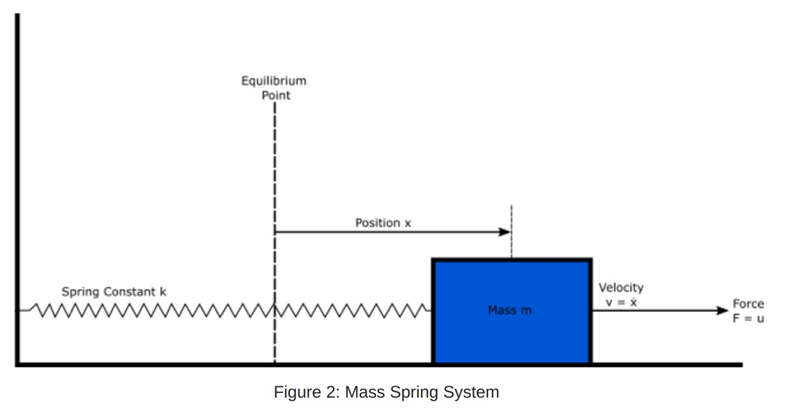
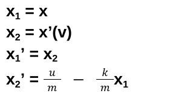
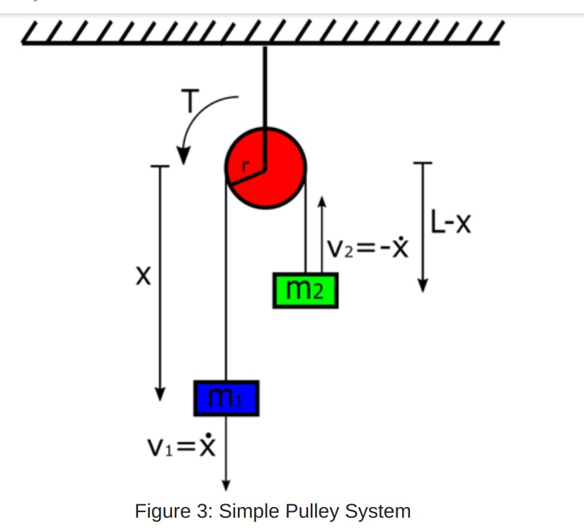
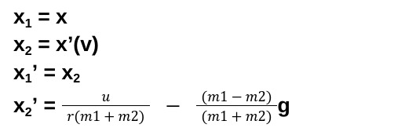
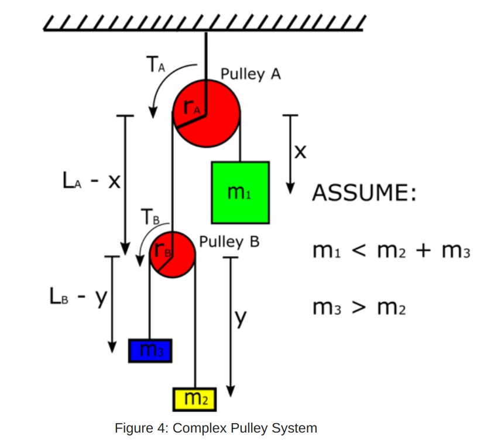
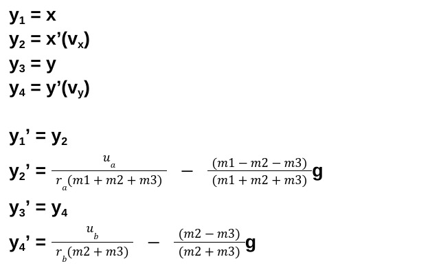
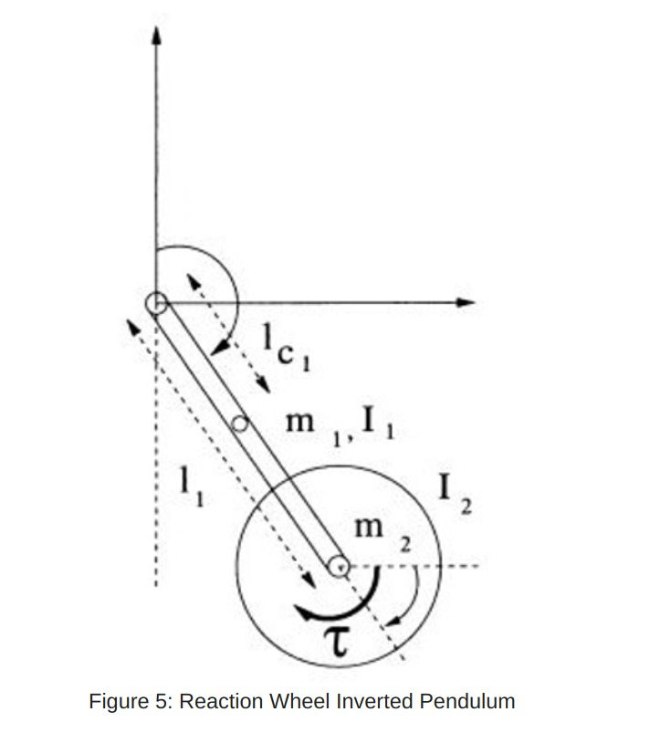
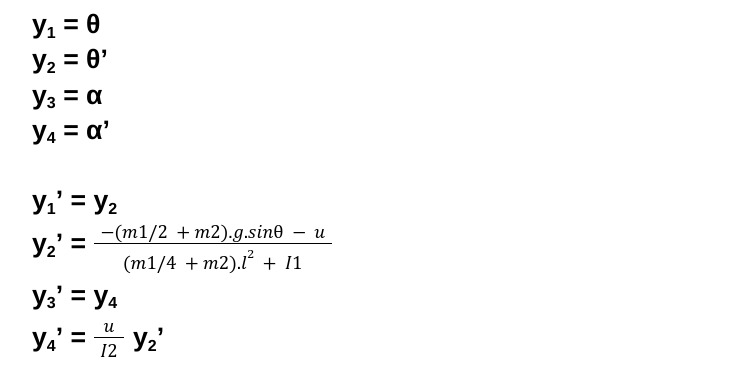

<h1>Procedures and Resources for Task 1</h3>
<h3>Table of Content</h3>
<ol>
  <li>
    <a href = "#task-1-1">Task 1.1</a>
   </li>
  <li>
    <a href = "#task-1-2">Task 1.2</a>
  </li>
   <li>
    <a href = "#task-1-3">Task 1.3</a>
  </li>
  </ol>
  
  
  # Task 1.1
  Task 1.1 involved writing basic Octave code for modelling a given system i.e. writing code for calulating things like Jacobian of a matrix and      determining its stability around a given point.
  
  
  # Task 1.2
  Task 1.2 involves writing octave code for simulating five physical systems. Also writing the functions for implementing the pole placement and LQR controllers on the said systems.
  Equations of motion used for solving each system are as follows.
  <ol>
  <li><h4>Simple Pendulum</h4>
    
    Equations :
     
    
  </li>
    <li><h4>Mass-Spring System</h4>
    
     
    Equations :
     
    
  </li>
    <li><h4>Simple Pulley</h4>
    
     
    Equations :
     
    
  </li>
   </li>
    <li><h4>Complex Pulley</h4>
    
     
    Equations :
     
    
  </li>
    <li><h4>Reaction-Wheel Inverted Pendulum</h4>
    
     
    Equations :
     
    
  </li>
  
  # Task 1.3
  
  This task involved us writing Lua code in Coppeliasim. We had to design a mathematical model for an inverted pendulum in Task 1.2. Using the values obtained from that task, we implement LQR in Coppeliasim and balance the inverted pendulum upright. 

## Refrences
<a href = "https://journals.indexcopernicus.com/api/file/viewByFileId/746635.pdf">Equations of Inverted Pendulum</a>

